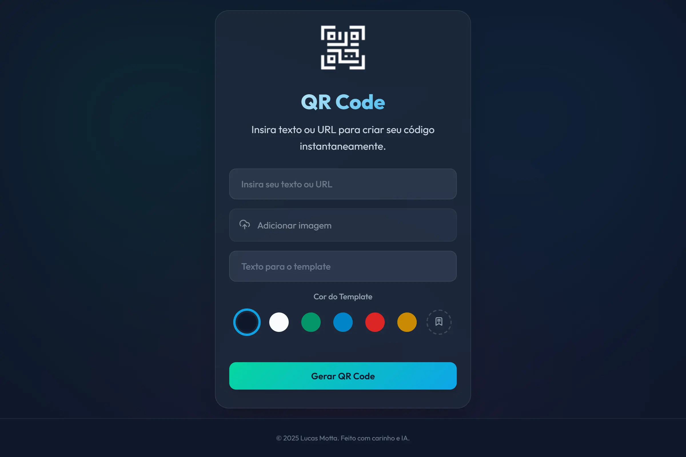

# Gerador de QR Code

Uma aplicação client-side para criar e personalizar QR Codes. Permite gerar códigos a partir de um texto, adicionar logo, texto customizado, escolher cores e baixar o resultado em alta resolução.



## Sobre o Projeto

Este projeto é desenvolvido com **Vanilla JavaScript e a API de Canvas**. A ferramenta coordena a geração do código, a personalização dos elementos visuais e a renderização final em uma imagem PNG, com todo o processamento ocorrendo no lado do cliente.

### Recursos

  * **100% Client-Side:** Não depende de servidor. A aplicação funciona offline após o primeiro carregamento.
  * **Personalização:** Permite adicionar um logo, um texto de apoio e aplicar cores customizadas.
  * **Download em Alta Resolução:** Exporta os QR Codes em diferentes resoluções (512px, 1024px e 2048px).
  * **Otimizações de Performance:** Utiliza `debounce` nos campos de entrada para evitar renderizações excessivas e realiza a compressão de imagens no navegador.
  * **Código Modular:** A lógica da aplicação é organizada em módulos para facilitar a manutenção.

### Como Funciona

A imagem final é construída através de um fluxo de renderização em camadas, utilizando a API de Canvas:

1.  **Geração do Código Base:** O texto ou URL é convertido em um QR Code pela biblioteca `qrcode.js` em um canvas temporário.
2.  **Validação de Ativos:** Se um logo for enviado, ele é validado e comprimido no navegador.
3.  **Renderização em Camadas:** Em um canvas visível, os elementos são desenhados na seguinte ordem:
      * Fundo com a cor selecionada.
      * Contêiner com bordas arredondadas.
      * Imagem do QR Code, centralizada.
      * Área de proteção branca sob o logo para garantir a legibilidade.
      * Texto de apoio na parte inferior, com fonte de tamanho dinâmico.
4.  **Exportação:** Ao clicar para baixar, o processo de renderização é repetido em um canvas em memória na resolução selecionada, gerando o arquivo PNG final.

### Decisões Técnicas

O projeto foi construído com os seguintes princípios:

  * **Arquitetura Modular:** O código é segregado em módulos com responsabilidades definidas (`Validator`, `QRRenderer`, `MemoryManager`, etc).
  * **Gerenciamento de Estado:** Um objeto `state` centralizado controla os dados da aplicação, tornando o fluxo de dados mais previsível.
  * **Gerenciamento de Memória:** Um `MemoryManager` é responsável pela limpeza de elementos temporários (canvas e Object URLs) para evitar vazamentos de memória.
  * **Processamento Client-Side:** Toda a carga de processamento é feita no navegador, eliminando a necessidade de backend.

### Estrutura do Projeto

```
generator-qrcode/
┣ 📜 index.html
┣ 📂 src/
┃ ┣ 📂 js/
┃ ┃ ┗ 📜 main.js
┃ ┗ 📂 style/
┃   ┗ 📜 main.css
┗ 📂 assets/
  ┗ 📂 images/
    ┗ 📜 (ícones, logos, etc.)
```

### Como Executar Localmente

1.  Clone o repositório:
    ```sh
    git clone https://github.com/lucaswotta/generator-qrcode.git
    ```
2.  Navegue até a pasta do projeto:
    ```sh
    cd generator-qrcode
    ```
3.  Abra o arquivo `index.html` no seu navegador.